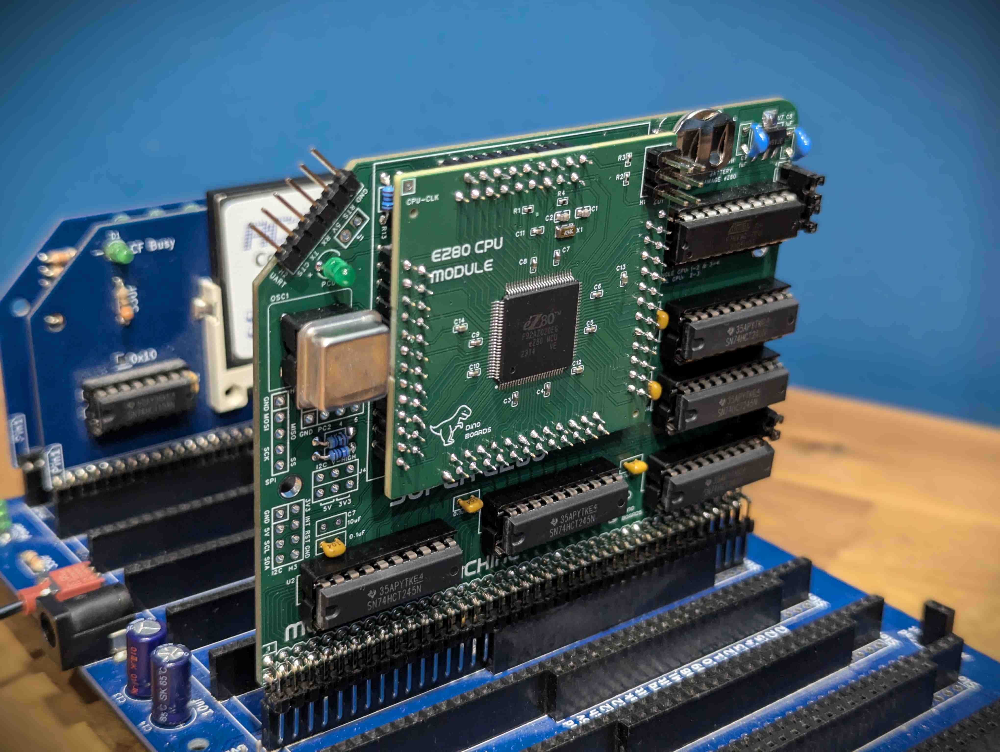

The *eZ80 for RC* is a CPU Module designed for the RCBus and RC2014<strong>&trade;</strong> backplanes.

The eZ80 Zilog CPU is an updated version of Z80 CPU. It comes in a few variations with many on chip facilities in addition to the basic CPU, such as flash ROM, RAM, GPIO and other IO services.

  

### eZ80 CPU

The eZ80 CPU is an enhanced version of the original Z80, largely maintaining compatibility with its predecessor while offering significant improvements. It can directly address up to 16MB of memory and achieves far greater performance per clock cycle due to increased instruction efficiency and pipelining. Additionally, it integrates various on-chip peripherals such as timers, UART, SPI, I2C, and GPIOs, reducing the need for external hardware components.

While the eZ80 might appear slow and limited by today's standards, it represents, I think, an interesting evolution from the original 1970s Z80 to the modern day embedded microcontrollers.

See the Wikipedia page for basic overview of the CPU (<a href="https://en.wikipedia.org/wiki/Zilog_eZ80">https://en.wikipedia.org/wiki/Zilog_eZ80</a>)

### Key features

<ul>
  <li>Compatibility with many existing RCBus and RC2014<strong>&trade;</strong> retro modules.</li>
  <li>A fun DIY kit that can be assembled by anyone with basic soldering skills.</li>
  <li>Works in conjunction with RomWBW/HBIOS ensuring a high degree of compatibility with existing OS and applications (HBIOS, CP/M, BASIC, etc).</li>
  <li>Lots of potential for to do your own hacking and tinkering with the eZ80.</li>
</ul>

### Schematics

* [eZ80 Interface Module (v1.7)](./assets/SCHEMATIC-EZ80-INTERFACE-V1.7.pdf)
* [ez80 CPU Module (v1.3)](./assets/SCHEMATIC-EZ80-V1.3.pdf)

### Kit Details

Coming soon to my Tindie Store, will be the *eZ80 for RC* kit.  For you to assemble and expand your RC2014<strong>&trade;</strong> or RCBus system

### What's included in the kit

The full kits includes everything you need.  Including the PCBs, capacitors, IC sockets, connectors, and the various ICs.  The included Programmable Logic Device (PLD) will also be flashed with the required logic.

The eZ80 CPU module will come with all the surface mounted components soldered.  You just need to solder the PCB pins and a standard 6 pin programming header.

A 20Mhz and an optional 25Mhz crystal to allow you to 'overclock' your eZ80.

See the Bill Of Material list for full details

### Bill Of Materials

|Quantity | Component|
|--------| -----------------------------------------|
|   2    | Right Angle 20x2 Header                  |
|   6    | 100nF                                    |
|   1    | 10uF Radial                              |
|   2    | 1uF Radial                               |
|   2    | HDR M 2.54 1x40                          |
|   2    | Shunts 1x2                               |
|   1    | 3mm Green LED                            |
|   1    | 20MHz Crystal Oscillator                 |
|   4    | 3.4mm 4.7kΩ resistor                     |
|   2    | 3.4mm 1kΩ resistor                       |
|   7    | 3.4mm 10kΩ resistor                      |
|   1    | 3.4mm 47Ω resistor                       |
|   1    | 3.4mm 470Ω resistor                      |
|   5    | 74HCT245                                 |
|   1    | ATF16V8C-7PU                             |
|   1    | TLV1117LV33DCYR                          |
|   1    | BAT-HLD-012-SMT                          |
|   1    | MCP130-475DI/TO                          |
|   6    | 20 POS IC DIP SOCKET                     |
|   1    | 4 POS SOCKET FOR OSCILLATOR              |
|  1     | Interface PCB for RC2014/RCBus Backplane |
|  1     | pre-assembled eZ80 CPU Module            |

### Disclaimer

Please note that this is a kit, produced by a non-professional (me) for hackers, DIYers' and retro lovers, to tinker with. I will do my best to answer any support questions you may have.

### Assembly Guide
