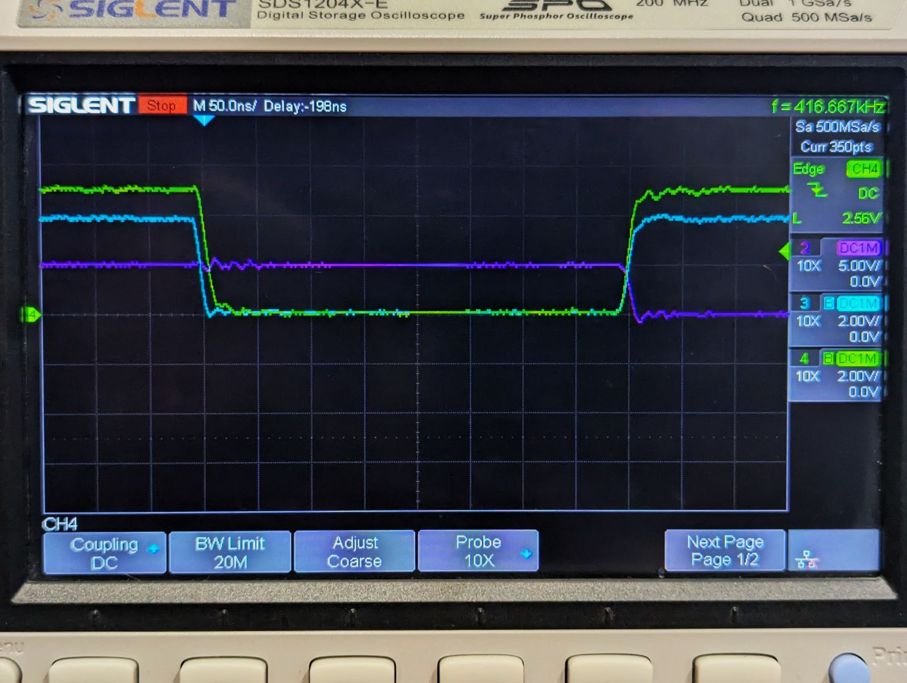

## Unknown glitch 1

There is a very strange and obscure issue with using the z80 emulation with the yellow MSX system.

During bootup, an error may occur where the boot up logo and characters fonts are scrambled.

This issue *ONLY* happens if the `in a,(c)` instruction implemented in the interpreter starts
at an address then ends in binary 01 (eg: %xxxx01, %xxxx03, %xxxx05, etc.)

### Things that have been observed:
1. Increasing I/O timing up to 15 B/C does resolve the issue.
2. Slowing the interpreter, by inserting lots of wait states between each instruction, does not resolve the issue.
3. Modifying the MSX code to disable interrupts for the duration of the CPU to VRAM command - resolves the issue.
4. Using the Tang Nano 20K HDMI V9958 module - does not reproduce the corruption.
5. Using an oscilloscope - I noted that the Address lines (A0, A1) are stable for the setup periods around the operations - but not for the hold period.
6. This issue has never been observed with the stock RC2014/RomWBW setup running natively on the eZ80's CPU.
7. Is not observed with a standard Z80 CPU.

### Other things to note:
1. The gap between the execution of the `out` instructions and the `in` instructions is very large -- many cycles between them.
2. All I/O operations are rate limited to avoid the VDP from being overloaded.

### The code that manifest the issue:
The initial MSX code that manifests the issue, loads an image onto the screen by invoking a MSX helper function that copies memory to VRAM,
by configuring the appropriate VDP command and then issuing a series of `OUT (%98), a` instructions for each byte.

During the copy, an interrupt from the VDP is likely to occur - causing the offending `in a, (c)` to be executed (where c is %99).

### Current hypothesis

I think there may be insufficient holding of the address lines when the CSR (chip select read) transition to high (in-active).  This causes the chip
to process an operation for another address - possibly the data port - which cause the current vram address maintained in the chip to advance.  The
data sheets for the V9938/58 are not super clear to me on what the VDP's requirements are here.

This hypothesis, does require the interrupt handler to have been fired multiple times, generating the `in a, (c)` - thus glitching the current internally maintained vram address.

See below a scope recording of an `in a, (c)` where the instruction is located at an address ending in xxx01.

* Green: eZ80 RD
* Light Blue: eZ80 IORQ
* Purple: A0

### eZ80 Only issue

This is only an issue for the eZ80 - and requires a very specific circumstance to manifest. My interface board deals with a similar issue with the `WR` (write signal) - where it extends the hold period at completion of a `WR` ;  making the electrical interface similar to a standard Z80.  I did not implement this hold extension for `RD` (read signal) process, as I reasoned (it seems incorrectly) it was not needed.

## Interrupt handling

The firmware will always boot to emulating a Z80 system attached to address 0x03xxxx

If the external boot code issues a SYSUTL_VER_EXCHANGE (RST.L %10), the system will transition to running the code thereafter in Z80 compatibility mode of the eZ80.

### Full Emulation System

In this scenario, where the boot system code has not issued a SYSUTL_VER_EXCHANGE, interrupts will always be executed via the emulator - as such it should always return from interrupts with a RET or RETI instruction.

If during the emulated execution as call.il is executed, the system will switch to native execution in ADL mode.  Any interrupts during this period will still be sent to the emulator environment.  The key difference in this scenario is that the return address of the interrupt will be address 0x0000.  The emulator will detect when the emulated PC is 0000 (typically due to a RETI or RET) and exit the emulator execution and return to the ADL native code.  When the ADL native code issues its RET.L, the emulator will resume after the initial CALL.il instruction

### Z80 Compatibility Mode

In this scenario, where the boot system code has issued a SYSUTL_VER_EXCHANGE, interrupts will always be 'marshalled' to address {MBASE}:0038.  The system must ensure its interrupt handler always completes with a RET.L instruction.

If the code executes the EMULATOR_INVOKE (RST.L %10) function, the emulator will emulate Z80 code execution until it encounters a RET.L instruction.
