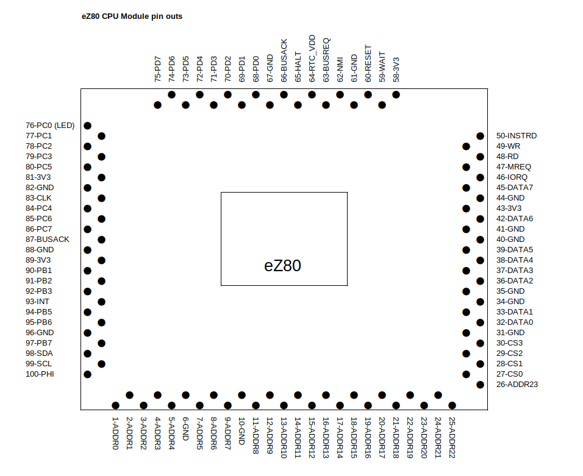
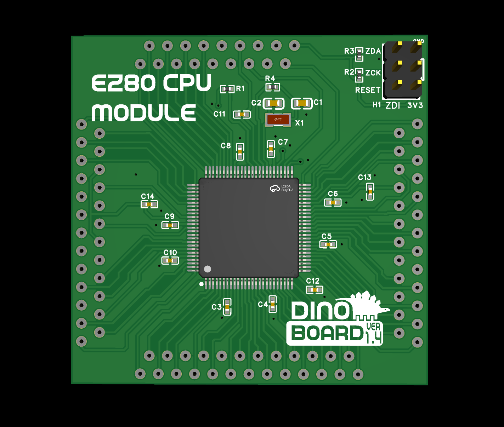

# PLD for the ez80 interface module.

The eZ80 module has a *Programmable Logic Device* (PLD). This PLD provides some slight modifications to the timing of some of the I/O signals from the eZ80 to improve compatibility with RC2014/RcBus modules.

## Errata

For PCB version 1.7, please note the following corrections:

1. Battery type is incorrectly stated as CR2016.  It should state support for batteries of type CR1225 or CR1216.
2. The main crystal oscillator (OSC1) is labelled with a frequency of 18.432MHz. It can actually support any frequency from 7.372MHz up to 20MHz. Overclocking is also possible; I have tested it up to 40MHz. For optimal performance, I recommend using a 25MHz crystal.
3. The pinout for the SPI interface is incorrect. The correct pinout from Pin 1 (at the top) down is:

<div style="padding-left: 20px;margin-top:-10px">
<ol>
<li>GND</li>
<li>SS</li>
<li>SCK</li>
<li>MISO</li>
<li>MOSI</li>
</ol>
</div>

### Building the PLD in linux

From within the hardware directory

```bash
docker run --rm -v ${PWD}:/ez80-for-rc/hardware/  -u $(id -u ${USER}):$(id -g ${USER}) -it dinoboards/wincupl:0.0.1 ./make-jed.sh
```

### Flashing the PLD in linux

```bash
minipro -p ATF16V8C -w ./bin/ez80-cpu-v1.7.jed
```

## Schematics

* [eZ80 Interface Module (v1.7)](../docs/assets/SCHEMATIC-EZ80-INTERFACE-V1.7.pdf)
* [ez80 CPU Module (v1.3)](../docs/assets/SCHEMATIC-EZ80-V1.3.pdf)


## eZ80 CPU Module pinout



## eZ80 CPU Module Render


