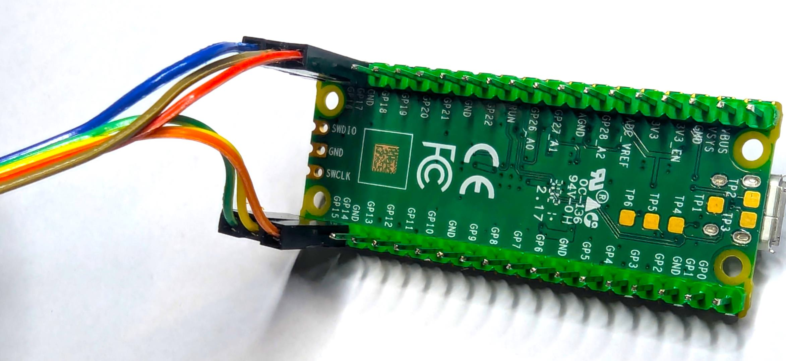

# Pi Pico Programmer

Use a Pi Pico to programme/flash the eZ80 CPU.  Designed for the **eZ80 for RCBus** solution - but may work for other eZ80 solution that have access to the ZDI interface (although I have only tested with my **eZ80 for RCBus**).

## Pre-compiled images

Precompiled images are available at:

* the 'official' releases at [https://github.com/dinoboards/ez80-for-rc/releases](https://github.com/dinoboards/ez80-for-rc/releases)
* the latest releases at [https://github.com/dinoboards/ez80-for-rc/actions](https://github.com/dinoboards/ez80-for-rc/actions)

## Building the code

Under linux, you can use a pre-built docker image that contains the required Raspberry Pi Pico tools and SDK:

Within the `programmer` directory, run this:

```
docker run --rm -v ${PWD}:/programmer/ -u $(id -u ${USER}):$(id -g ${USER}) --privileged=true -it dinoboards/pipico:0.0.2 /bin/bash -c "mkdir -p build && cd build && cmake .. && make"
```

You can also use VS Code, with the official `Raspberry Pi Pico` VS Code extension [https://github.com/raspberrypi/pico-vscode](https://github.com/raspberrypi/pico-vscode)

A successful build will create a file called `programmer.uf2` in the `programmer\build` directory

## Updating your Pi Pico

1. Press and hold the BOOTSEL button on the Pico
2. While holding BOOTSEL, plug the USB cable from the Pico into your PC
3. The Pico should appear as a Mass Storage Device on your computer - look for a new drive letter.
4. Copy the `programmer.uf2` to the root of the mounted storage device.
5. After copying, the device should reboot
6. Confirm you can connect on serial over USB, using your favourite serial terminal application (such as PuTTY).  You will need to find the COMx number that the USB has remounted as.
  (On linux it may mount the serial device as /dev/ttyACM0.  Using minicom, the following open a serial connection to the device: `minicom -D /dev/ttyACM0`)

## Wiring the Pi Pico to your eZ80 ZDI interface

| Pi Pico | ZDI Interface   |
|---------|-----------------|
| GPIO 15 | ZCL             |
| GPIO 14 | ZDA             |
| GPIO 16 | RESET           |
| GPIO 17 | ZDI's PWR (3V3) |
| GND *   | GND *           |

\* Make sure you have short leads, and that the 2 ground pins of the ZDI are connected to ground pins of the Pi Pico


When looking at the front of the eZ80 CPU module, the pin layout is as follows:


<div style="margin-left: 20px;">
<table style="table-layout: auto; width: auto;">
  <tr>
    <td>ZDA</td>
    <td>GND</td>
  </tr>
  <tr>
    <td>ZCK</td>
    <td>GND</td>
  </tr>
  <tr>
    <td>RESET</td>
    <td>3V3</td>
  </tr>
</table>
</div>

You can use the images below, and follow the colours the ensure you have correct wiring:


<div style="margin-left: 20px;">
<table style="table-layout: auto; width: auto;">
  <tr>
    <td>Yellow - ZDA - GPIO 14</td>
    <td>Orange - GND</td>
  </tr>
  <tr>
    <td>Green - ZCK - GPIO 15</td>
    <td>Red - GND</td>
  </tr>
  <tr>
    <td>Blue - RESET - GPIO 16</td>
    <td>Brown - 3V3 - GPIO 17</td>
  </tr>
</table>
</div>

<div style="text-align: center;">
    <a href="../docs/assets/ez80-zdi-connector-left-side-example.jpg" target="_blank">
      
    </a>
    <a href="../docs/assets/ez80-zdi-connector-right-side-example.jpg" target="_blank">
      
    </a>

<a href="../docs/assets/pi-pico-example-wiring.jpg" target="_blank">
  
</a>
</div>

### Flashing your eZ80 CPU

1. Plug a USB cable between your *Pi Pico Programmer* and your main PC.
2. If using windows, identify the mounted COMx port (use Device Manager).  For linux look for the /dev/tty device.
3. Using your favourite terminal program (such as PuTTY), connect to your *Pi Pico Programmer*
You should see a message like:

```
ZDI Connection ......:    (PWR: FAIL, RST: FAIL, ZDA: FAIL, ZCL: FAIL)
```
<ol start="4">
<li>Power on your eZ80's RC2014/RCBus backplane.</li>
You should now see a message like:
</ol>

```
ZDI Connection OK:  (PWR: OK, RST: OK, ZDA: OK, ZCL: OK)
eZ80 Detected:  ID 0007 Rev AAitialisation...
Available Firmware Version: 0.1.2.0 (2024-10-03)
ZDI>
```

<ol start="5">
<li>Enter the command <code>FLASH</code></li>
<li>Your Pi Pico Programmer should have reported a completed flash of your eZ80.</li>
<li>If you have RomWBW installed on an external memory module, you should now be able to start your retro computer.
<br/>Enter <code>REBOOT</code> to start it.
</li>
</ol>

> To see your retro computer, you will need to have the UART serial connection of the Interface Module connected to a terminal application.


## Operating instructions

Within your serial connection to the Pi Pico Programmer, you can issue a number of commands.

`help` Will show the list of commands available

The current implemented commands are:

```
Commands:

help or h
  Display this help message

status or s
  Display the ZDI status register (ZDI_STAT)

flash [upload]
  Flash the eZ80 with a new firmware image
  default loads the firmware stored on Pi Pico
  upload: expects an intel hex file to be streamed over stdin

verify [upload]
  Read the current firmware version image
  and compare to verify correctness
  upload: expects an intel hex file to be streamed over stdin

break or b
  break the ez80

continue or c
  continue the ez80

reset
  reset the ez80 (internal only reset line is not triggered)

mode or m [ADL|Z80]
  Set the CPU mode to ADL or Z80

led [on|off]
  Configure PC0 as output and turn led on or off

rd or read [ADDR]
  Read bytes from memory

str [ADDR]
  Read a null terminated string from memory

reboot
  Reset and restart the eZ80 firmware
```
