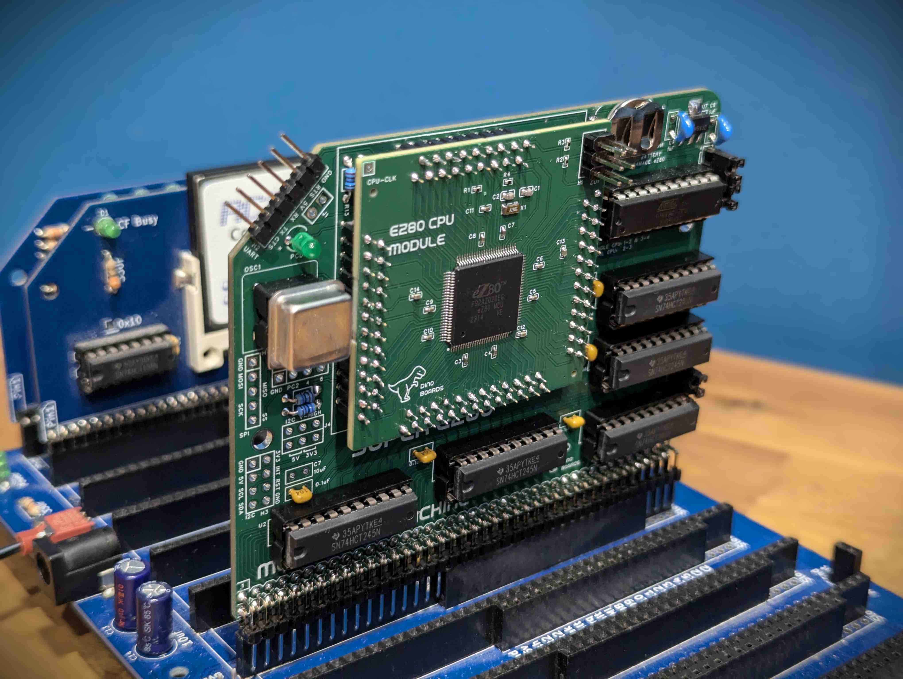
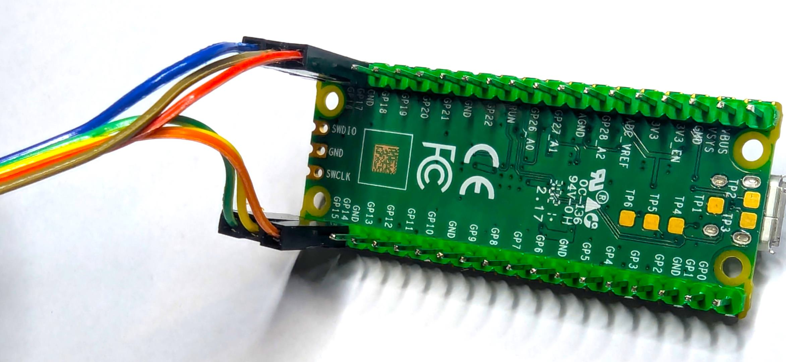
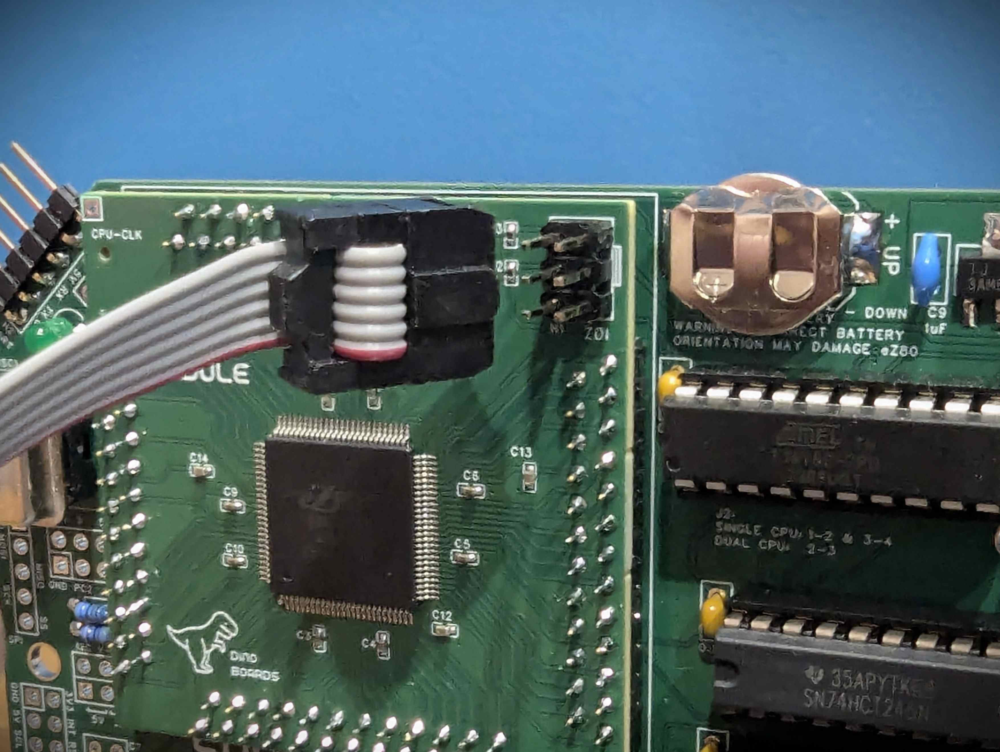
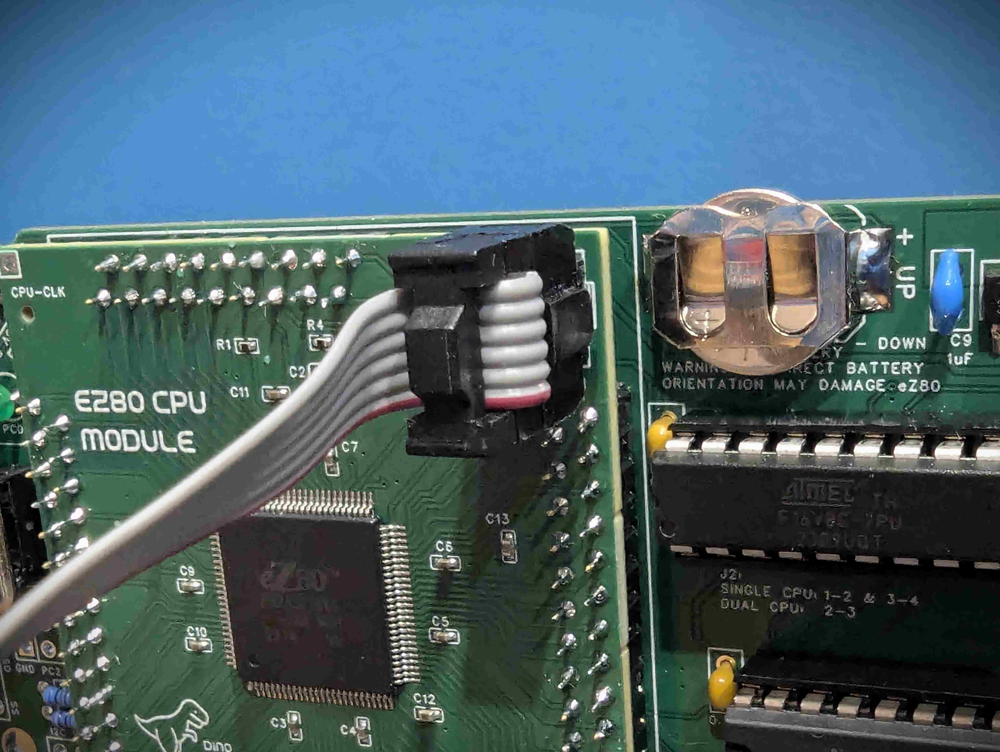

## eZ80 for the RCBus/RC2014

The eZ80 for RCBus/RC2014 is a module designed for the RCBus and RC2014 backplanes.

Its designed as a 'compatible upgrade' to the stock Z80 CPU.  The eZ80 is a CPU that was first released by Zilog about 20 years ago, and still available from the manufacturer today.

If you want to read through the full development history of this project, have a look at my hackaday project page: https://hackaday.io/project/196330-ez80-cpu-for-rc2014-and-other-backplanes

also mirrored at https://dinoboards.github.io/ez80-for-rc2014-backplanes/

  

# eZ80 CPU

The eZ80 CPU is an enhanced version of the original Z80, largely maintaining compatibility with its predecessor while offering significant improvements. It can directly address up to 16MB of memory and achieves far greater performance per clock cycle due to increased instruction efficiency and pipelining. Additionally, it integrates various on-chip peripherals such as timers, UART, SPI, I2C, and GPIOs, reducing the need for external hardware components.

While the eZ80 might appear slow and limited by today's standards, it represents, I think, an interesting evolution from the original 1970s Z80 to the modern day embedded microcontrollers.

# Repository Contents

This repository includes:
* [firmware](./firmware/readme.md): Firmware for the on-chip flash ROM of the eZ80
* [programmer](./programmer/readme.md): Code and instructions for using a Raspberry Pi Pico module to flash the firmware (an alternative to the Zilog eZ80 Acclaim USB Smart Cable)
* [hardware](./hardware/readme.md): PLD/JED code for the ATF16V8 PLD required for the eZ80 RCBus Interface Module
* [apps](./apps/readme.md): A collection of CP/M applications to support and explore the eZ80

## RomWBW

This eZ80 module needs to be installed into a RC2014 or RCBus compatible backplane, and paired with a compatible ROM/RAM module running RomWBW (eg: the RC2014 Stock 512K ROM/RAM module).

The RomWBW image needs to be assembled with the EZ80 STD target (see RomWBW build instructions).

See [RomWBW](https://github.com/wwarthen/RomWBW)

## Yellow MSX

With the latest firmware (date 2026-06-20 or after), the eZ80 can operate as a CPU for the Yellow MSX series.  It achieves this by executing all Z80 code through an interpreter, aka the Z80 emulator.

In this emulation mode, it achieves a performance similar to a standard Z80 at around 3.5MHz.  Since its not able to achieve cycle-accurate execution of Z80 code, some instructions will be slower and while others will be faster.  For example the repeating instructions (eg: LDIR, OTIR) will operate significantly faster - whereas most instructions will incur some overhead due to the interpreter.

So far I have tested with NEXTOR/MSX-BASIC BIOS and a small number of cartridge-based games without observing any issues. The games seem to play at normal speed, and sounds are reproduced correctly.  In testing the games, I did not play all the way through - just the first few levels - higher levels might trigger compatibility issues.  Games tested include: "Pacman," "Salamander," and "Metal Gear".

### Programming/Flashing the eZ80

Before you can boot you will need to have written an image onto the eZ80's internal ROM.  For that you will need a 'programmer'.

There are 2 options for the programmer.  The Zilog's official programmer (*Zilog eZ80 Acclaim USB Smart Cable*), available from many hardware suppliers such as digikey or mouser; Or a much lower cost alternative is to use a Pi Pico.

#### Pi Pico Programmer

Click here for instructions for setting up a [Pi Pico Programmer](https://www.dinoboards.com.au/pi-pico-programmer)

  

#### Zilog's Programmer

This is the official programmer for the eZ80 from Zilog.  It cost over a $100 US dollars - so not cheap.

* [Digikey link](https://www.digikey.com.au/en/products/detail/zilog/ZUSBASC0200ZACG/17374332)
* [Mouser link](https://au.mouser.com/ProductDetail/692-ZUSBASC0200ZACG)

The eZ80 CPU module features a 6-pin header for connecting the Zilog programmer's IDC connector. It is important to note that this header is not keyed, which means the connector can be attached in the incorrect orientation.

The silk screen on the PCB indicates the correct orientation for the IDC connector.

Refer to the following images for the correct installation orientation.

  
  

 
 

> Incorrect orientation may result in damage to the CPU and or the programmer.  I have yet to do it to find out what happens!

You will need to clone this repo and open the project with Zilog Developer Studio II (ZDSII - eZ80Acclaim!) - available for download at [https://www.zilog.com/index.php?option=com_zcm&task=sdlp&Itemid=74](https://www.zilog.com/index.php?option=com_zcm&task=sdlp&Itemid=74)

