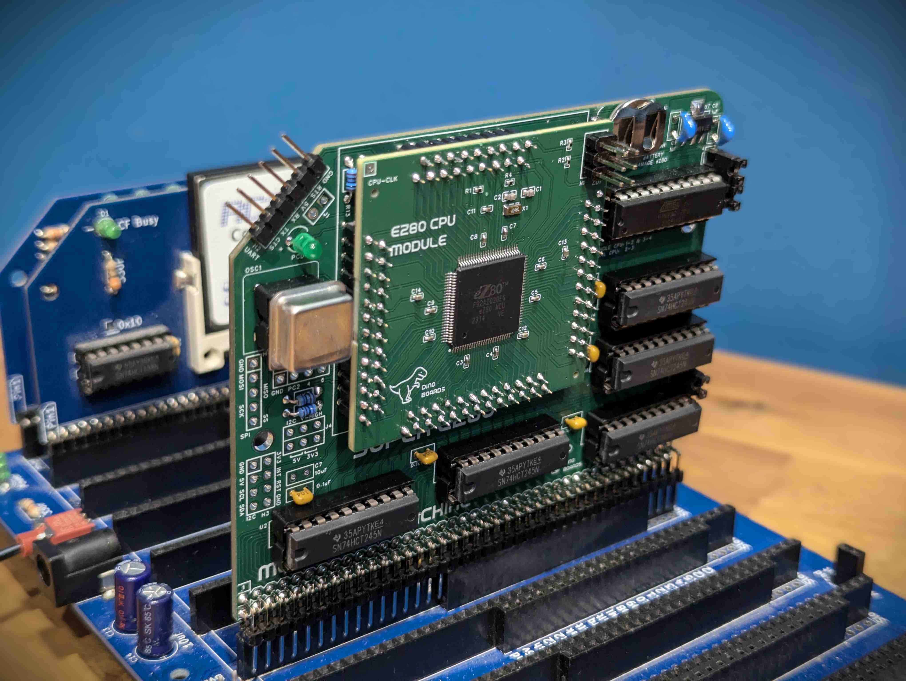
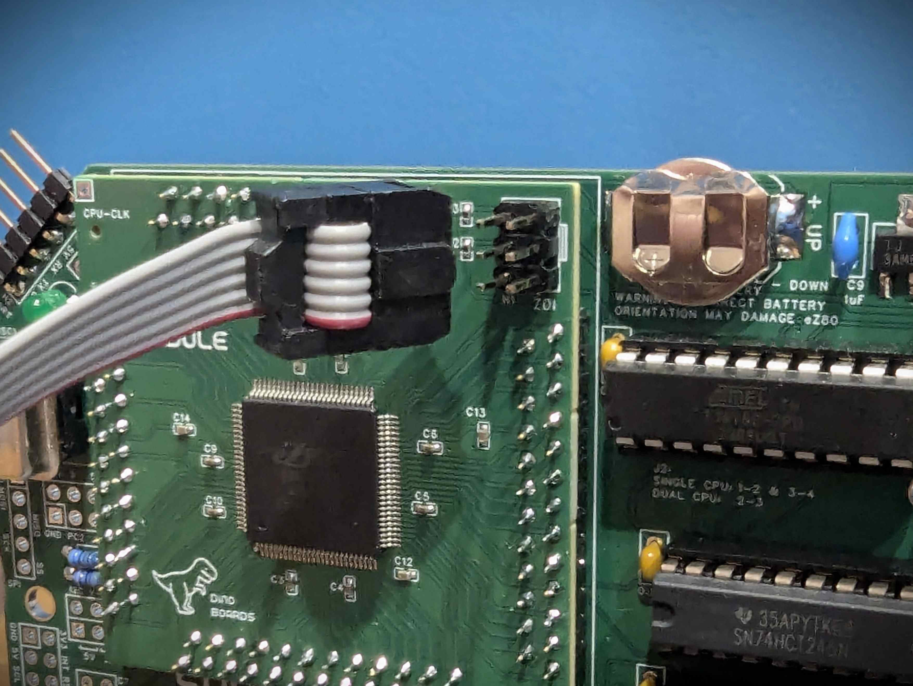
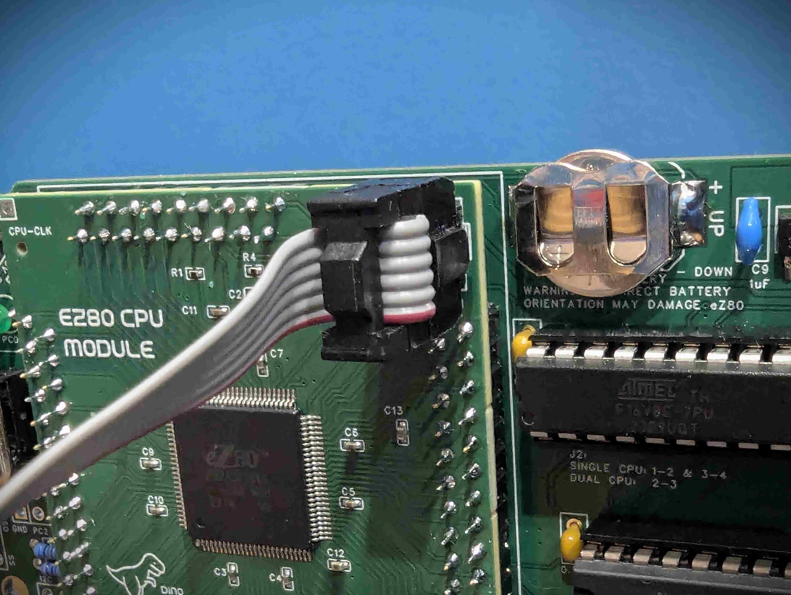

## eZ80 Firmware for the RC2014 Platform

This repo contains the code required for operating the eZ80 CPU on an RCBus/RC2014 platform.  It is has been primarily designed to support the EZ80 configuration within RomWBW.

The firmware will manage startup, configuration of on-chip devices, interrupt marshalling and handover to external ROM/RAM modules in Z80 compatibility mode.

Full description and progress at my hackaday project page: https://hackaday.io/project/196330-ez80-cpu-for-rc2014-and-other-backplanes

also mirrored at https://dinoboards.github.io/ez80-for-rc2014-backplanes/

  

## Solution

This firmware is for an eZ80 based RCBus/RC2014 compatible module. This module can be used instead of a stock Z80 CPU module.

It needs to be paired with a compatible ROM/RAM module running RomWBW (eg: the RC2014 Stock 512K ROM/RAM module).

The RomWBW image needs to be assembled with the EZ80 STD target (see RomWBW build instructions).

## RomWBW

This firmware is designed to work in conjunction with HBIOS/RomWBW developed and maintained by Wayne Warthen.

See [RomWBW](https://github.com/wwarthen/RomWBW)

## Building the firmware code

This is a ZDSII ez80Acclaim (5.3.5) project.

The build process requires a windows installation, and that the source be placed in a specific absolute path:

Recommend process:
* Clone repo to `Z:\rc2014-ez80`
* Install the ZDS IDE to `Z:\ZDS`
* Using ZDSII IDE, open the project file in Z:\rc2014-ez80\firmware\rc2014-firmware.zdsproj

> Many of the configuration files created and managed by the ZDSII IDE include full absolute paths to files.  So if you try open the project file
under a different local path, many of the project files will be updated to that path.  It may possibly still work -- but if you wish to contribute to this repo, you would need to undo all these path changes.

### Using a local share to create a 'Z' drive on your PC

If like me, you don't have an actual drive mounted as `Z:`, you can create a network mount to a directory on your computer.

1. Choose/create any empty directory on your computer.
2. Create a network share on this directory (typically right click on windows explorer and choose Properties, then choose 'Share' tab) - call it `EZ80`
3. Mount a drive on your local computer to this newly created network share (you may have to manually enter the network path `\\<your-computer-name>\EZ80`)
4. Mount and ensure you select 'Reconnect at sign-in'

Once you have created a `Z:` drive, you can follow the recommended instruction above to clone this repo.

### Zilog Tool set

The Zilog ZDS IDE can be found at: https://zilog.com/index.php?option=com_zcm&task=view&soft_id=54&Itemid=74

As mentioned above, recommended you install it into the path `Z:\ZDS`

> You should end up with the executable files within the directory `Z:\ZDS\bin\`

This is a very old tool set.  But it does allow for on-chip debugging.

### Zilog Hardware Programmer Tool

To load the firmware onto the eZ80 module, you will need the *Zilog eZ80 Acclaim USB Smart Cable*

It can be purchased from suppliers such as digikey and mouser

* Digikey link: https://www.digikey.com.au/en/products/detail/zilog/ZUSBASC0200ZACG/17374332
* Mouser link: https://au.mouser.com/ProductDetail/692-ZUSBASC0200ZACG

### Programming/Flashing

The eZ80 CPU module features a 6-pin header for connecting the Zilog programmer's IDC connector. It is important to note that this header is not keyed, which means the connector can be attached in the incorrect orientation.

The silk screen on the PCB indicates the correct orientation for the IDC connector.

Refer to the following images for the correct installation orientation.

  
  

 
 

> Incorrect orientation may result in damage to the CPU and or the programmer.  I have yet to do it to find out what happens!
